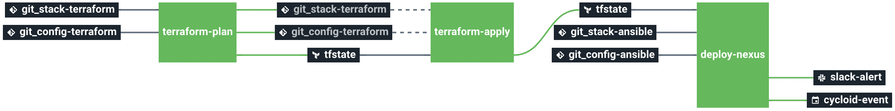

# stack-nexus-repository

Deploys a virtual machine and installs Nexus Repository on it.

This stack will:
  * Create a vpc or vnet and subnets.
  * Create an instance.
  * Deploy Nexus Repository on the instance.

# Requirements

To run this stack, you will need:
  * an [AWS S3 bucket](https://docs.aws.amazon.com/quickstarts/latest/s3backup/step-1-create-bucket.html) or an [Azure Blob Storage](https://azure.microsoft.com/en-us/services/storage/blobs/) or an [GCP Cloud Storage](https://cloud.google.com/storage) to store Terraform remote states.
  * an SSH key pair to access the created instance remotely (it will be used to run the ansible playbook).

# Details

## Pipeline

**Jobs description**

  * `terraform-plan`: Terraform job that will simply make a plan of the infrastructure's stack. It is automatically triggered upon resources changes.
  * `terraform-apply`: Terraform job similar to the plan one, but will actually create/update everything that needs to. Please see the plan diff for a better understanding. It is automatically triggered upon tfstate file changes after terraform-plan job completes.
  * `deploy-nexus`: Ansible playbook job which deploys and configures a Nexus Repository. It is automatically triggered upon tfstate file changes after terraform-apply job completes.
  * `terraform-destroy`: :warning: Terraform job meant to destroy the whole stack - **NO CONFIRMATION ASKED**. If triggered, the full project **WILL** be destroyed. Use with caution.

# Params

## AWS

### Pipeline
|Name|Description|Type|Default|Required|
|---|---|:---:|:---:|:---:|
|`aws_access_key`|Amazon AWS access key for Terraform. See value format [here](https://docs.cycloid.io/advanced-guide/integrate-and-use-cycloid-credentials-manager.html#vault-in-the-pipeline)|`-`|`((aws.access_key))`|`True`|
|`aws_default_region`|Amazon AWS region to use for Terraform.|`-`|`eu-west-1`|`True`|
|`aws_secret_key`|Amazon AWS secret key for Terraform. See value format [here](https://docs.cycloid.io/advanced-guide/integrate-and-use-cycloid-credentials-manager.html#vault-in-the-pipeline)|`-`|`((aws.secret_key))`|`True`|
|`config_ansible_path`|Path of Ansible files in the config git repository|`-`|`($ project $)/ansible/environments`|`True`|
|`config_git_branch`|Branch to use on the config Git repository.|`-`|`config`|`True`|
|`config_git_private_key`|SSH key pair to fetch the config Git repository.|`-`|`((git.ssh_key))`|`True`|
|`config_git_repository`|Git repository URL containing the config of the stack.|`-`|`git@github.com:cycloidio/cycloid-stacks-test.git`|`True`|
|`config_terraform_path`|Path of Terraform files in the config git repository|`-`|`($ project $)/terraform/aws/($ environment $)`|`True`|
|`customer`|Name of the Cycloid Organization, used as customer variable name.|`-`|`($ organization_canonical $)`|`True`|
|`cycloid_api_key`|API key to grant admin acess to Cycloid API.|`-`|`((cycloid-api-key.key))`|`True`|
|`cycloid_api_url`|Cycloid API URL.|`-`|`https://http-api.cycloid.io`|`True`|
|`env`|Name of the project's environment.|`-`|`($ environment $)`|`True`|
|`keypair_private`|The private SSH key allowing ansible to run playbooks in the Nexus Repository instance via bastion|`-`|`((custom_keypair.ssh_prv))`|`True`|
|`keypair_public`|The public SSH key to provision to bastion for external access through SSH|`-`|`((custom_keypair.ssh_pub))`|`True`|
|`project`|Name of the project.|`-`|`($ project $)`|`True`|
|`stack_ansible_path`|Path of Ansible files in the stack git repository|`-`|`stack-get-started/ansible`|`True`|
|`stack_git_branch`|Branch to use on the stack Git repository.|`-`|`master`|`True`|
|`stack_git_private_key`|SSH key pair to fetch the stack Git repository.|`-`|`((git.ssh_key))`|`True`|
|`stack_git_repository`|Git repository URL containing the stack.|`-`|`git@github.com:cycloidio/cycloid-demo-stacks.git`|`True`|
|`stack_terraform_path`|Path of Terraform files in the stack git repository|`-`|`stack-get-started/terraform/aws`|`True`|
|`terraform_storage_bucket_name`|AWS S3 bucket name to store terraform remote state file.|`-`|`($ organization_canonical $)-terraform-remote-state`|`True`|
|`terraform_version`|terraform version used to execute your code.cycloid-toolkit docker image tag to use (https://hub.docker.com/r/cycloid/cycloid-toolkit/tags).|`-`|`'1.0.5'`|`True`|
|`vm_os_user`|Admin username for newly created instances|`-`|`admin`|`True`|

### Terraform
|Name|Description|Type|Default|Required|
|---|---|:---:|:---:|:---:|
|`extra_tags`|Dict of extra tags to add on resources. format { "foo" = "bar" }.|`-`|`{}`|`False`|
|`keypair_public`|The public SSH key, for SSH access to newly-created instances|`-`|`""`|`False`|
|`nexus_admin_password`|Initial admin password in case of first installation|`-`|`changeme`|`False`|
|`nexus_port`|Port where Nexus Repository service is exposed|`-`|`8081`|`False`|
|`vm_disk_size`|Disk size for the Nexus Repository (Go)|`-`|`20`|`False`|
|`vm_instance_type`|Instance type for the Nexus Repository|`-`|`'t3.micro'`|`False`|

## Azure

### Pipeline
|Name|Description|Type|Default|Required|
|---|---|:---:|:---:|:---:|
|`azure_client_id`|Azure client ID to use for Terraform.|`-`|`((azure.client_id))`|`True`|
|`azure_client_secret`|Azure client secret to use for Terraform.|`-`|`((azure.client_secret))`|`True`|
|`azure_env`|Azure environment to use for Terraform. Can be either `public`, `usgovernment`, `german` or `china`.|`-`|`public`|`True`|
|`azure_location`|Azure location to use for terraform. |`-`|`West Europe`|`True`|
|`azure_subscription_id`|Azure subscription ID to use for Terraform.|`-`|`((azure.subscription_id))`|`True`|
|`azure_tenant_id`|Azure tenant ID to use for Terraform.|`-`|`((azure.tenant_id))`|`True`|
|`config_ansible_path`|Path of Ansible files in the config git repository|`-`|`($ project $)/ansible/environments`|`True`|
|`config_git_branch`|Branch to use on the config Git repository.|`-`|`config`|`True`|
|`config_git_private_key`|SSH key pair to fetch the config Git repository.|`-`|`((git.ssh_key))`|`True`|
|`config_git_repository`|Git repository URL containing the config of the stack.|`-`|`git@github.com:cycloidio/cycloid-stacks-test.git`|`True`|
|`config_terraform_path`|Path of Terraform files in the config git repository|`-`|`($ project $)/terraform/azure/($ environment $)`|`True`|
|`customer`|Name of the Cycloid Organization, used as customer variable name.|`-`|`($ organization_canonical $)`|`True`|
|`cycloid_api_key`|API key to grant admin acess to Cycloid API.|`-`|`((cycloid-api-key.key))`|`True`|
|`cycloid_api_url`|Cycloid API URL.|`-`|`https://http-api.cycloid.io`|`True`|
|`env`|Name of the project's environment.|`-`|`($ environment $)`|`True`|
|`keypair_private`|The private SSH key allowing ansible to run playbooks in the Nexus Repository instance via bastion|`-`|`((custom_keypair.ssh_prv))`|`True`|
|`keypair_public`|The public SSH key to provision to bastion for external access through SSH|`-`|`((custom_keypair.ssh_pub))`|`True`|
|`project`|Name of the project.|`-`|`($ project $)`|`True`|
|`stack_ansible_path`|Path of Ansible files in the stack git repository|`-`|`stack-get-started/ansible`|`True`|
|`stack_git_branch`|Branch to use on the stack Git repository.|`-`|`master`|`True`|
|`stack_git_private_key`|SSH key pair to fetch the stack Git repository.|`-`|`((git.ssh_key))`|`True`|
|`stack_git_repository`|Git repository URL containing the stack.|`-`|`git@github.com:cycloidio/cycloid-demo-stacks.git`|`True`|
|`stack_terraform_path`|Path of Terraform files in the stack git repository|`-`|`stack-get-started/terraform/azure`|`True`|
|`terraform_version`|terraform version used to execute your code.cycloid-toolkit docker image tag to use (https://hub.docker.com/r/cycloid/cycloid-toolkit/tags).|`-`|`'1.0.5'`|`True`|
|`vm_instance_status`|Instance status for the Nexus Repository|`-`|`Running`|`True`|
|`vm_os_user`|Admin username for newly created instances|`-`|`nexus`|`True`|

### Terraform
|Name|Description|Type|Default|Required|
|---|---|:---:|:---:|:---:|
|`azure_location`|Azure location|`-`|`"West Europe"`|`False`|
|`extra_tags`|Dict of extra tags to add on resources. format { "foo" = "bar" }.|`-`|`{}`|`False`|
|`keypair_public`|The public SSH key, for SSH access to newly-created instances|`-`|`""`|`False`|
|`nexus_admin_password`|Initial admin password in case of first installation|`-`|`changeme`|`False`|
|`nexus_port`|Port where Nexus Repository service is exposed|`-`|`8081`|`False`|
|`rg_name`|The name of the existing resource group where the resources will be deployed|`-`|`'cycloid-get-started'`|`False`|
|`vm_disk_size`|Disk size for the Nexus Repository (Go)|`-`|`20`|`False`|
|`vm_instance_type`|Instance type for the Nexus Repository|`-`|`'t3.micro'`|`False`|
|`vm_os_user`|Admin username for newly created instances|`-`|`nexus`|`False`|

## GCP

### Pipeline
|Name|Description|Type|Default|Required|
|---|---|:---:|:---:|:---:|
|`config_ansible_path`|Path of Ansible files in the config git repository|`-`|`($ project $)/ansible/environments`|`True`|
|`config_git_branch`|Branch to use on the config Git repository.|`-`|`config`|`True`|
|`config_git_private_key`|SSH key pair to fetch the config Git repository.|`-`|`((git.ssh_key))`|`True`|
|`config_git_repository`|Git repository URL containing the config of the stack.|`-`|`git@github.com:cycloidio/cycloid-stacks-test.git`|`True`|
|`config_terraform_path`|Path of Terraform files in the config git repository|`-`|`($ project $)/terraform/gcp/($ environment $)`|`True`|
|`customer`|Name of the Cycloid Organization, used as customer variable name.|`-`|`($ organization_canonical $)`|`True`|
|`cycloid_api_key`|API key to grant admin acess to Cycloid API.|`-`|`((cycloid-api-key.key))`|`True`|
|`cycloid_api_url`|Cycloid API URL.|`-`|`https://http-api.cycloid.io`|`True`|
|`env`|Name of the project's environment.|`-`|`($ environment $)`|`True`|
|`gcp_credentials_json`|Google Cloud Platform credentials JSON for Terraform. See value format [here](https://docs.cycloid.io/advanced-guide/integrate-and-use-cycloid-credentials-manager.html#vault-in-the-pipeline)|`-`|`((gcp.json_key))`|`True`|
|`gcp_project`|Google Cloud Platform project to use for Terraform.|`-`|`($ organization_canonical $)`|`True`|
|`gcp_region`|Google Cloud Platform region to use for Terraform.|`-`|`europe-west1`|`True`|
|`keypair_private`|The private SSH key allowing ansible to run playbooks in the Nexus Repository instance via bastion|`-`|`((custom_keypair.ssh_prv))`|`True`|
|`keypair_public`|The public SSH key to provision to bastion for external access through SSH|`-`|`((custom_keypair.ssh_pub))`|`True`|
|`project`|Name of the project.|`-`|`($ project $)`|`True`|
|`stack_ansible_path`|Path of Ansible files in the stack git repository|`-`|`stack-get-started/ansible`|`True`|
|`stack_git_branch`|Branch to use on the stack Git repository.|`-`|`master`|`True`|
|`stack_git_private_key`|SSH key pair to fetch the stack Git repository.|`-`|`((git.ssh_key))`|`True`|
|`stack_git_repository`|Git repository URL containing the stack.|`-`|`git@github.com:cycloidio/cycloid-demo-stacks.git`|`True`|
|`stack_terraform_path`|Path of Terraform files in the stack git repository|`-`|`stack-get-started/terraform/gcp`|`True`|
|`terraform_version`|terraform version used to execute your code.cycloid-toolkit docker image tag to use (https://hub.docker.com/r/cycloid/cycloid-toolkit/tags).|`-`|`'1.0.5'`|`True`|
|`vm_os_user`|Admin username for newly created instances|`-`|`admin`|`True`|

### Terraform
|Name|Description|Type|Default|Required|
|---|---|:---:|:---:|:---:|
|`extra_tags`|Dict of extra tags to add on resources. format { "foo" = "bar" }.|`-`|`{}`|`False`|
|`keypair_public`|The public SSH key, for SSH access to newly-created instances|`-`|`""`|`False`|
|`nexus_admin_password`|Initial admin password in case of first installation|`-`|`changeme`|`False`|
|`nexus_port`|Port where Nexus Repository service is exposed|`-`|`8081`|`False`|
|`vm_disk_size`|Disk size for the Nexus Repository (Go)|`-`|`20`|`False`|
|`vm_machine_type`|Machine type for the Nexus Repository|`-`|`'n2-standard-2'`|`False`|
